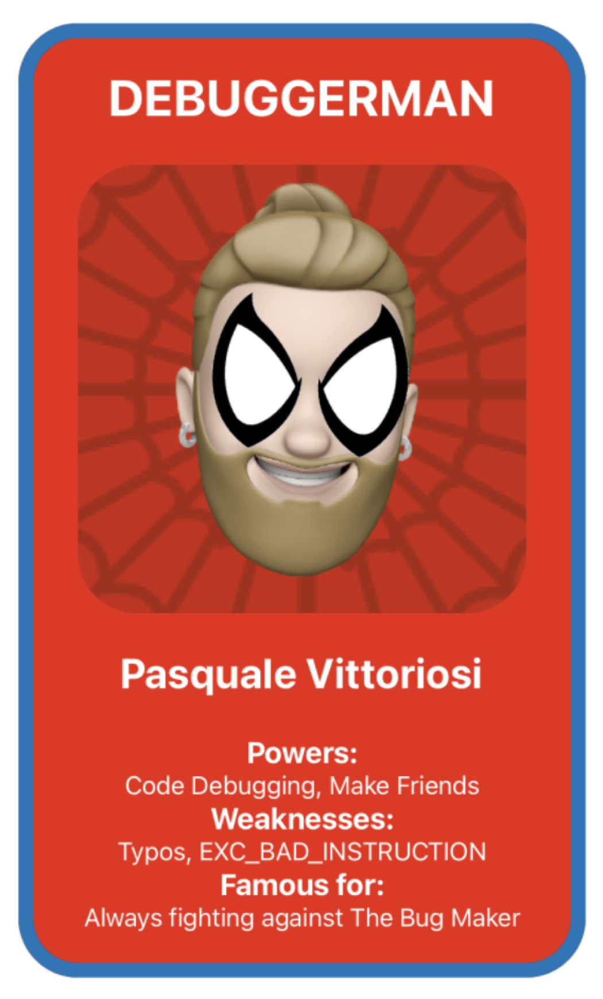

<div align="center">
  <h3>Workshop</h3>
  <h1>Superhero Card</h1>
  <br />
  <a href="https://github.com/developer-academy-unina/workshop-superhero-card/issues/new?assignees=&labels=bug&template=01_BUG_REPORT.md&title=bug%3A+">Report a Bug</a>
  
</div>
  <br />
<p align="center">
  <a href="#" alt="Version">
    
  </a>
  <a href="#" alt="XCode Version">
    
  </a>        
  <a href="#" alt="Swift Version">
    
  </a>
  <a href="#" alt="Framework used">
    
  </a>          
</p>

<details open="open">
<summary>Table of Contents</summary>

- [About](#about)
- [Getting Started](#getting-started)
  - [Installation](#installation)
  - [How to](#how-to)
- [Issues and Discussions](#issues-and-discussions)
- [Support](#support)
- [Authors & contributors](#authors--contributors)
- [License](#license)

</details>

---
<br />

## About

Explore Xcode, the essential tool of a world Class Developer, by becoming a superhero and creating your Superhero Card with an actual iOS app.

<summary>Screenshots</summary>
<br>

|                               Superhero Card                               |                                  Xcode                                          |
| :-------------------------------------------------------------------: | :--------------------------------------------------------------------: |
|  |  |

<br />

## Getting Started

### Installation

1. Clone the repo

   ```sh
   git clone https://github.com/developer-academy-unina/workshop-superhero-card
   ```

2. Open the ```.xcodeproj``` file

### How to

1. Edit & Personalise the ```SuperheroCardView```

2. Run the App on your device

3. Share your achievement and exhange your superhero card with your peers

<br />

## Issues and Discussions

You've found a bug in the source code, a mistake in the documentation or maybe you'd like a new feature? Take a look at [GitHub Discussions](https://github.com/developer-academy-unina/workshop-superhero-card/discussions) to see if it's already being discussed. You can help us by [submitting an issue on GitHub](https://github.com/developer-academy-unina/workshop-superhero-card/issues). Before you create an issue, make sure to search the issue archive -- your issue may have already been addressed!

Please try to create bug reports that are:

- _Reproducible._ Include steps to reproduce the problem.
- _Specific._ Include as much detail as possible: which version, what environment, etc.
- _Unique._ Do not duplicate existing opened issues.
- _Scoped to a Single Bug._ One bug per report.

<br />

## Support

Reach out to the maintainer at one of the following places:

- [GitHub Discussions](https://github.com/developer-academy-unina/workshop-superhero-card/discussions)
- [GitHub issues](https://github.com/developer-academy-unina/workshop-superhero-card/issues/new?assignees=&labels=question&template=04_SUPPORT_QUESTION.md&title=support%3A+)
- Contact a Mentor for any other help

<br />

## Authors & contributors

The original setup of this repository is by [Pasquale Vittoriosi](https://github.com/PasqualeVittoriosi).

For a full list of all authors and contributors, see [the contributors page](https://github.com/developer-academy-unina/workshop-superhero-card/contributors).

<br />

## License

This project is licensed under the **MIT License**.

See [LICENSE](LICENSE) for more information.
